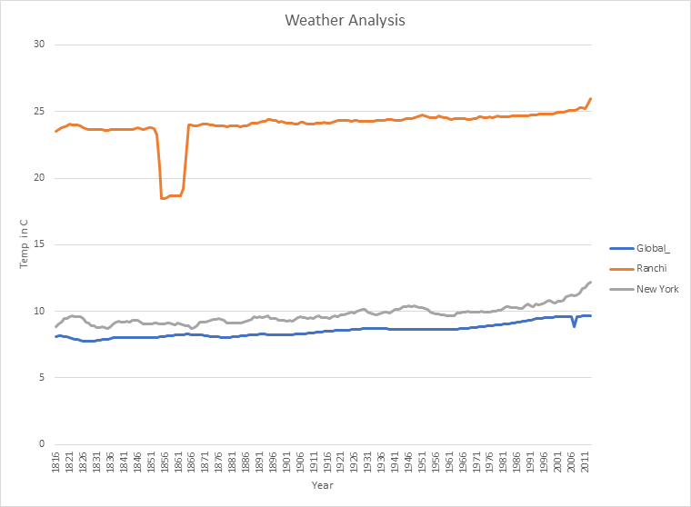

# Weather Trends


**Data Extraction :**
Data was extractedd from udactiy SQL workspace. SQL query used to extract the data from Database are :
```
	SELECT * FROM city_list;
	SELECT * FROM city_data;
	SELECT * FROM global_data; 
```		

 **Microsoft Excel 2010** is used for preparation and analysis of the data.

**Steps :**
+ Read and observe the available data.  
+ Calculate the moving average of global temperature.  
+ Find out your nearest city.  
+ Calculate the moving average of the city temperature.  
+ Join the tables. o Create a Pivot Table.  
+ Create a line chart. 
+ Find Correlation coefficient.  

**Moving Average :**
In statistics, a moving average is a calculation to analyze data points by creating a series of averages of different subsets of the full data set. It is also called a moving mean or rolling mean and is a type of finite impulse response filter.
To calculate the moving average, subset of 10 data points where taken at a time for the calculation.  
Built in function AVERAGE (range) was used to calculate the moving average

**LIne Chart :**



**Observations :**
+ Global average temperature is much lower compared to average temperature in Ranchi and Ludhiana.
+	In chart we can see that there was sudden decrease in temperature during 1855-1862, there is also noticeable decrease in temperature i.e., 22° C during 1925-1930, but temperature of Ranchi has been consistent in past few decades i.e., approx. 24° C.
+	New York temperature is much lower if compared to my city. 
+	New York temperature is increasing gradually.
+	Global temperature is also increasing gradually.

